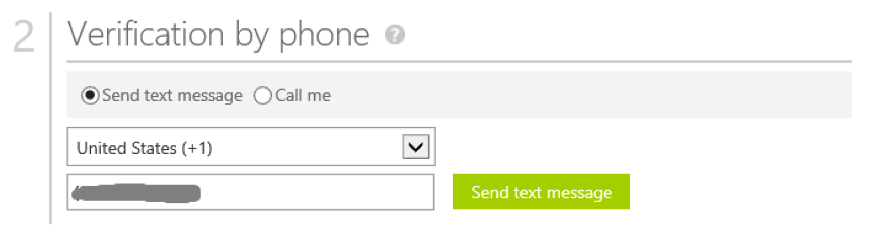
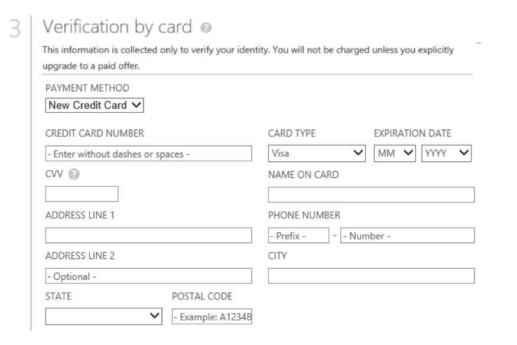

# Booster Conference 2018

## Stage 1 - Getting Started

To get started you'll need the following pre-requisites. Please take a few moments to ensure everything is installed and configured.

* Computer
* Visual Studio Code
* Azure Subscription
   * Trial
   * Azure account linked to a Visual Studio subscription or MSDN account.
* Azure SDK for .NET 
   * Ensure to get the right version
* Storage Explorer
* Storage Emulator
* The starter project on Github

### What You're Building

Azure is big. Really big. Too big to talk about all things Azure in just 3 hours.

This exciting workshop will introduce you to several Azure services that cloud developers should know about:

* BLOB storage
* Table storage
* Functions
* Cognitive Services API for computer vision

In this workshop you'll learn how to use these Azure services, and build a cloud-hosted serverless that allows you to upload profile pictures that pass through an AI content filter to ensure they're work appropriate.

Key concepts and takeaways

* Navigating the Azure portal
* Using Azure Resource Groups to manage multiple Azure services
* Creating Azure storage accounts
* Azure Table storage
* Storing images in Azure BLOB storage
* Using Azure functions to coordinate asynchronous processes
* Consuming the Microsoft Cognitive Services API to analyze images

### Materials

You can find additional lab materials and presentation content at the locations below:

Presentation: https://raw.githubusercontent.com/DamianFlynn/Events/master/2018-03-Booster/Azure%20Serverless.pptx
Source code for the code used in this guide: https://github.com/DamianFlynn/Events/tree/master/2018-03-Booster

### Creating a Trial Azure Subscription

> NOTE: If you have an Azure account already, you can skip this section. If you have a Visual Studio subscription (formerly known as an MSDN account), you get free Azure dollars every month. Check out the next section for activating these benefits.

There are several ways to get an Azure subscription, such as the free trial subscription, the pay-as-you-go subscription, which has no minimums or commitments and you can cancel any time; Enterprise agreement subscriptions, or you can buy one from a Microsoft retailer. In exercise, you'll create a free trial subscription.

#### Exercise: Create a Free Trial Subscription

1. Browse to the following page http://azure.microsoft.com/en-us/pricing/free-trial/ to obtain a free trial account.

1. Click Start free.

1. Enter the credentials for the Microsoft account that you want to use. You will be redirected to the Sign up page.

   > NOTE: Some of the following sections could be omitted in the Sign up process, if you recently verified your Microsoft account.

1. Enter your personal information in the About you section. If you have previously loaded this info in your Microsoft Account, it will be automatically populated.

   

1. In the Verify by phone section, enter your mobile phone number, and click Send text message.

   

1. When you receive the verification code, enter it in the corresponding box, and click Verify code.

   

1. After a few seconds, the Verification by card section will refresh. Fill in the Payment information form.

   > NOTE: Your credit card will **not be billed**, *unless* ***you remove the spending limits***. If you run out of credit, your services will be shut down unless you choose to be billed.
   
   

1. In the Agreement section, check the **I agree** to the subscription Agreement, offer details, and privacy statement option, and click **Sign up**.

1. Your free subscription will be set up, and after a while, you can start using it. Notice that you will be informed when the subscription expires.

   

1. Your free trial will expire in 29 days from it's creation.

   

### Activating Visual Studio Subscription Benefits

If you happen to be a Visual Studio subscriber (formerly known as MSDN) you can activate your Azure Visual Studio subscription benefits. It is no charge, you can use your MSDN software in the cloud, and most importantly you get up to $150 in Azure credits every month. You can also get 33% discount in Virtual Machines and much more.

#### Activate Visual Studio Subscription Benefits

1. To active the Visual Studio subscription benefits, browse to the following URL: http://azure.microsoft.com/en-us/pricing/member-offers/msdn-benefits-details/

1. Scroll down to see the full list of benefits you will get for being a MSDN member. There is even a FAQ section you can read.

1. Click Activate to activate the benefits.

   

1. You will need to enter your Microsoft account credentials to verify the subscription and complete the activation steps.

