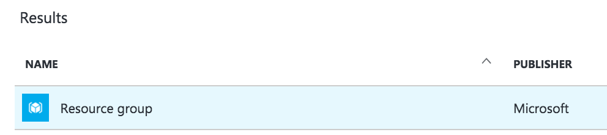

# Booster Conference 2018

## Stage 2 - Big Picture

Imagine a production service, in which we enable users with the ability to upload an image for their profile picture? Some images just aren't suitable for a work environment.

Wouldn't it be nice to add a step into the profile image upload process where images were screened? But, who's going to do the screening? Do you really have time to screen every images uploaded. Maybe it makes sense for a small organisation, but what happens when there's thousands of users?

For me, there's no chance that I would introduce a manual screen step. Instead, I'd look for every opportunity to automate this process so I can spend the time to write code once, and use it every time someone changes their profile picture.

Over the next hours, we'll be building an automated image screening process using Microsoft's Cognitive Services Computer Vision API. We'll combine various Azure services: blob storage containers, an Azure function listening for changes to a blob container, and REST service calls to the computer vision API. The computer vision API will process each uploaded image, indicating whether it is work appropriate. Images that are acceptable will be moved to the profile picture blob container. Invalid images will be moved to a separate container.

##  Blob Storage

We begin with a quick introduction on how to create an Azure storage account.

### Creating a Resource Group

Our first stop will be to create a Resource Group in Azure.

> DEFINITION 
> Formally, resource groups provide a way to monitor, control access, provision and manage billing for collections of assets that are required to run an application, or used by a client or company department. Informally, think of resource groups like a file system folder, but instead of holding files and other folders, resource groups hold azure objects like storage accounts, web apps, functions, etc.

### Create a Dashboard and Resource Group

#### Creating a Dashboard

We'll start by creating a dashboard.

* Login to the Azure portal
* click + New Dashboard, 
* Give the dashboard name, 
* click Done customizing.

   

That was easy! Dashboards are a quick way of organizing your Azure services. We like to create one for the workshop because it helps keep everything organized. You'll have a single place to go to find everything you build today.

#### Creating a Resource Group

Next, we'll create a resource group to hold the various services we'll be creating today.

1. Click the + New button on the left.

   

1. Search for resource group by using the search box, selecting Resource Group when it appears.

   

1. Select Resource Group from the search results window:

   

1. Click Create at the bottom:

   

1. Give the Resource group a name, select your Azure subscription, and a location. Also CHECK the Pin to Dashboard option. Press Create when you're finished.

   

1. After it's created, it will be open in Azure automatically:

   

1. Close the resource group by clicking the X in the upper-right corner. Note that the resource group has been added to your dashboard.

   

1. Form the dashboard, you can click on the resource group to re-open it at any time.

That wraps up the basics of creating resource groups. We're not going to take a deep dive into Azure Resource Group. If you're interested in learning more, check out this article.

### Creating a Storage Account
Our next stop is at Storage Accounts. You'll recall from the last chapter that storage accounts are the topmost Azure service that contains other resources such as the blob storage, file storage, queue storage, and table storage services.

Before we can store data to an Azure table, we'll need to create a storage account.

#### Create a Storage Account

Return to your dashboard if you're not already there. 

Click + New, select Storage from the list of service categories, and select Storage account - blob, file, table, queue.

Complete the following fields:

* **Name:** this must be a unique, URL-friendly name that will be prepended to the URL *{storage-account-name}.core.windows.net.* You'll use this full URL name to reference the storage account in code

* **Deployment model:** Resource manager. The Classic option is a legacy option that will be deprecated soon. Don't pick it. Choosing the Resource manager options also allows you to create automation scripts for provisioning Azure resources easily

* **Account kind:** General purpose. You can create an account that stores only blobs (binary large objects), but for our workshop we want a storage account that can store both tables and blobs

* **Performance:** Standard, because our needs are simple. If you were an enterprise, you may want to choose Premium for the enhanced SLA and scalability. To learn more about the difference, check out this article

* **Replication:** Locally-redundant storage (LRS). The data in your Microsoft Azure storage account is always replicated to ensure durability and high availability. Replication copies your data, either within the same data center, or to a second data center, depending on which replication option you choose. Replication protects your data and preserves your application up-time in the event of transient hardware failures. If your data is replicated to a second data center, that also protects your data against a catastrophic failure in the primary location. To learn more read this article.

* **Storage service encryption:** Disabled. Azure Storage Service Encryption (SSE) for Data at Rest helps you protect and safeguard your data to meet your organizational security and compliance commitments. With this feature, Azure Storage automatically encrypts your data prior to persisting to storage and decrypts prior to retrieval. The encryption, decryption, and key management are totally transparent to users. To learn more, read this article.

* **Subscription:** Select your subscription.
* **Resource group:** Use existing and select the resource group you just created. By selecting the existing resource group, the storage account will be added to the resource group. This makes it easier to manage.

* **Location:** West Europe
* **PIN to dashboard:** Yes

All Azure services deployed with the Resource Manager option are deployed in an asynchronous manner.

When the storage account is provisioned, it will open up in the portal.

From the storage account details pages, you can explore the contents of blobs, files, tables, and queues. The experience is similar to that of storage explorer.

#### Accessing a Storage Account in Storage Explorer

Now that you've added a storage account to your Azure Subscription, let's check it out in Storage Explorer.

Storage Explorer is a standalone app from Microsoft that allows you to easily work with Azure Storage Accounts on Windows, macOS and Linux.

We'll be using Storage Explorer throughout the workshop to peek into the local storage account (created by the Storage Emulator) and Azure-hosted storage account.

Let's get started!

#### Starting up the Azure Storage Emulator

> If you have not already installed Storage explorer, install it from the following link: https://azure.microsoft.com/en-us/features/storage-explorer/

After installing, You'll find Storage Explorer in your start menu. Open the start menu, type in storage, and look for Microsoft Azure Storage Explorer under the Apps section:

1. When Storage Explorer launches for the first time, you'll be prompted to connect to Azure Storage:

   
  
1. Click Sign In and enter your Azure account credentials.

   

1. After entering your credentials, you'll see a list of Azure subscriptions associated with your account. 
   > NOTE: You can have multiple subscriptions linked to your account (like mine), or just one.

1. On the left-hand side, you'll see a list of azure subscriptions and local storage accounts. Locate the storage account. Drill down to Storage Accounts -> (Booster2018) -> Tables.

1. Take note there are no tables in your local storage account.

   

Congratulations! That's how easy it is to use Storage Explorer.