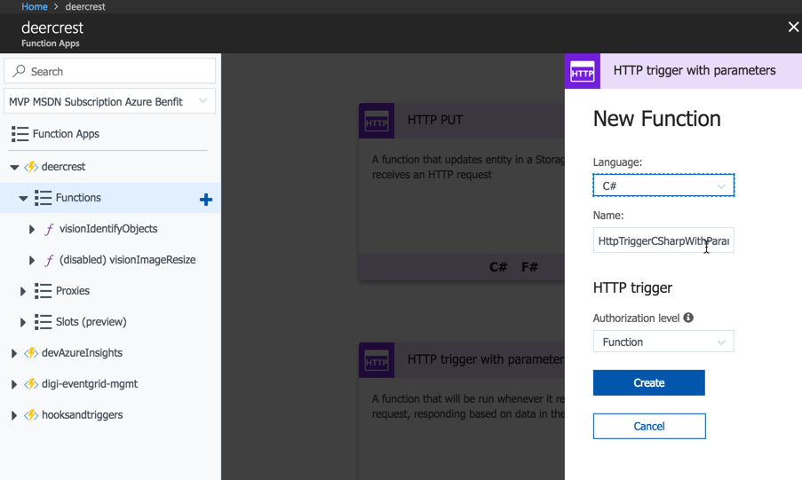
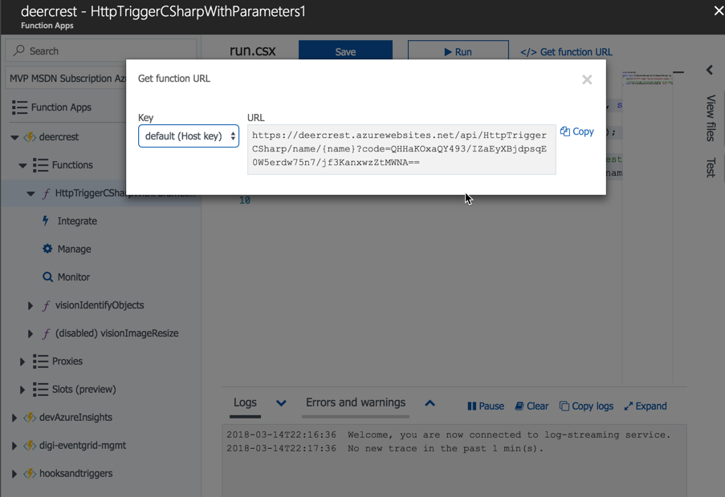
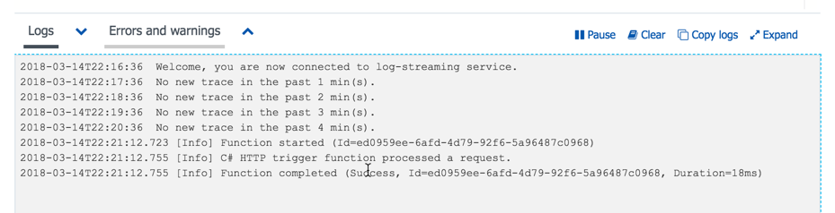
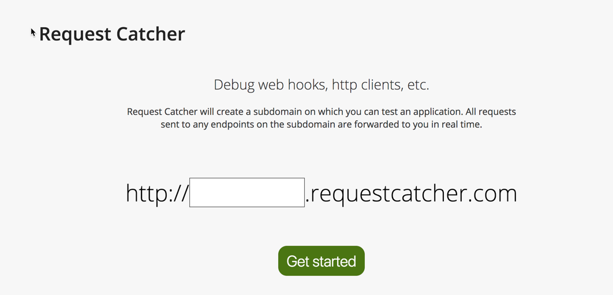
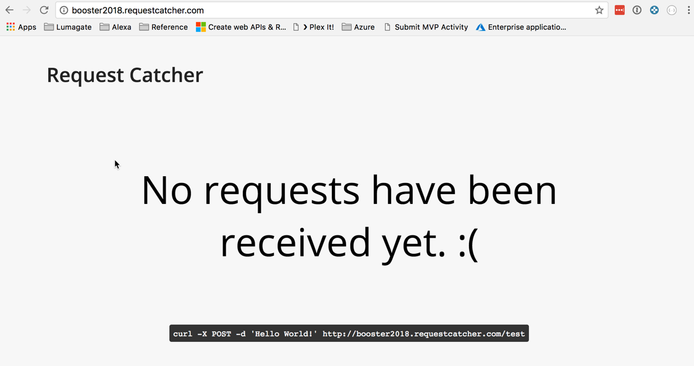
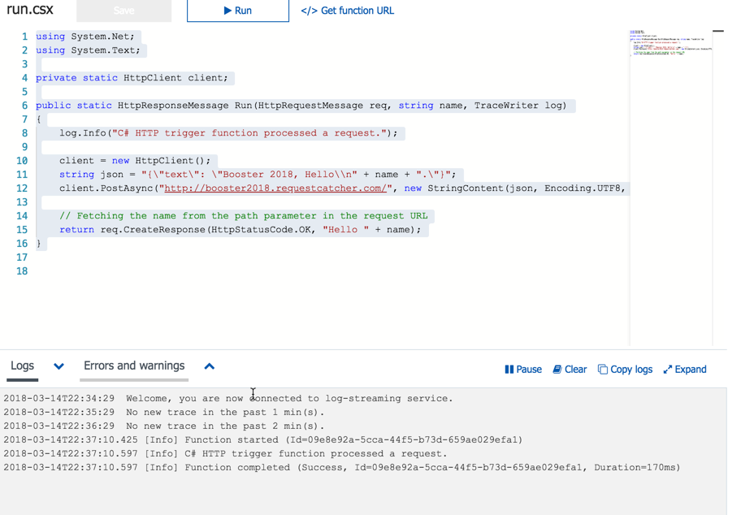
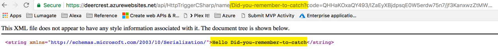
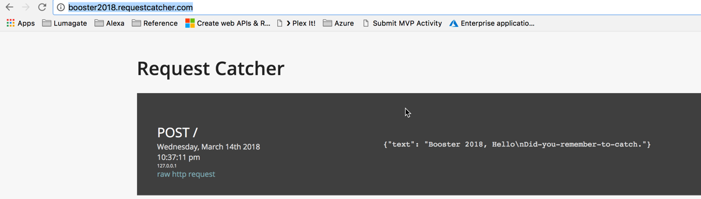
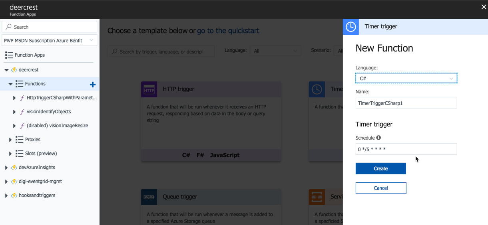
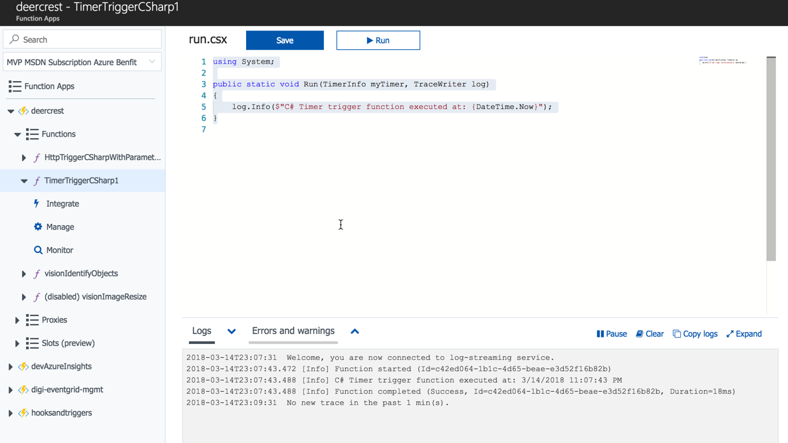

# Booster Conference 2018

## Serverless

Add our first function

1. Select the Function Type as **HTTP Trigger with Paramaters** using **C#**

   

1. The function should be automatically created, with some sample code

```csharp
using System.Net;

public static HttpResponseMessage Run(HttpRequestMessage req, string name, TraceWriter log)
{
    log.Info("C# HTTP trigger function processed a request.");

    // Fetching the name from the path parameter in the request URL
    return req.CreateResponse(HttpStatusCode.OK, "Hello " + name);
}

```

1. To identify the trigger of the function, click on the link **</> Get function URL**

   

1. Copy the URL, we need this to launch the test `https://deercrest.azurewebsites.net/api/HttpTriggerCSharp/name/{name}?code=QHHaKOxaQY493/IZaEyXBjdpsqE0W5erdw75n7/jf3KanxwzZtMWNA==`

1. Now, after browsing to the address, the function will be triggered, and we will see the results in the calling platform, and the logs of the function

   

Super!


## Pass the Data forward

### Request Bin

1. Setup an account on http://RequestCatcher.com

   

1. Enter a name for the catcher in the field, for example `booster2018`

1. Click **Get Started**

1. The page will refresh, and show any requests which have been captured

   

### New Function Code

Now, add some more code, this time, we will post our payload forward, to a request Bin

```csharp
using System.Net;
using System.Text;

private static HttpClient client;

public static HttpResponseMessage Run(HttpRequestMessage req, string name, TraceWriter log)
{
    log.Info("C# HTTP trigger function processed a request.");

    client = new HttpClient();
    string json = "{\"text\": \"Booster 2018, Hello\\n" + name + ".\"}";
    client.PostAsync("http://booster2018.requestcatcher.com/", new StringContent(json, Encoding.UTF8, "application/json"));

    // Fetching the name from the path parameter in the request URL
    return req.CreateResponse(HttpStatusCode.OK, "Hello " + name);
}

```

1. Update the Function, and Run it, with the logs exposed

   

1. Trigger the Function again

   

1. The result should also be posted to the request bin

   

Congratulations!


## Time Trigger

1. Create a new Time Based Triggered Function

   

1. The Default behaviour is based on CRON, and will run every 5 minutes

1. The Function will be created with a basic configuration

```csharp
using System;

public static void Run(TimerInfo myTimer, TraceWriter log)
{
    log.Info($"C# Timer trigger function executed at: {DateTime.Now}");
}
```

1. Start the function, and monitor the log

   


### RSS Feed

As a demo, lets have a function parse a list of Posts in an RSS Feed `http://rssmix.com/u/3890669/rss.xml` 

This will then post the Artical URI to our webhook, for further processing; For example we could establish a function to translate the post to a different language.


```csharp
#r "System.Xml.Linq"

using System;
using System.Xml.Linq;
using System.Text;

private static HttpClient client;

public static async Task Run(TimerInfo myTimer, TraceWriter log)
{
    log.Info($"C# Timer trigger function executed at: {DateTime.Now}");
    
    client = new HttpClient();

    var rssFeed = await client.GetStringAsync("http://rssmix.com/u/3890669/rss.xml");
    if (string.IsNullOrWhiteSpace(rssFeed))
    {
        log.Info("Failed to get feed");
        return;
    }

    // Create an Object
    XDocument doc = XDocument.Parse(rssFeed);
    var query = from element in doc.Element("rss").Element("channel").Elements("item")
                select new { Title = element.Element("title").Value, Date = Convert.ToDateTime(element.Element("pubDate").Value), Id = element.Element("guid").Value };
    var articals = query.OrderByDescending(x => x.Date).ToList();

    foreach (var post in articals)
    {
        log.Info("Post " + post.Id );
        string json = "{\"Post\": \" " + post.Id + "\"}";
        client.PostAsync("http://booster2018.requestcatcher.com/", new StringContent(json, Encoding.UTF8, "application/json"));

    }
}

```


## Blob Triggered Function

### Basic Configuration

#### Prepare the blob

1. Create a storage account
1. Create a container

#### Prepare the function

1. Create a new Function
1. Add a new integration
   1. Update the Binding to use the new Blob
   1. Look at the bindings JSON Defination
   1. Add a Paramater `name` to the source

```json
{
  "bindings": [
    {
      "name": "myBlob",
      "type": "blobTrigger",
      "direction": "in",
      "path": "data/{name}",
      "connection": "deercrest_STORAGE"
    }
  ],
  "disabled": false
}
```

#### Create the Function

Create a sample function

```csharp
using System;

public static async Task<HttpResponseMessage>  Run(Stream myBlob, string name, TraceWriter log)
{
    log.Info($"Processing image Name:{name},  Size: {myBlob.Length} bytes");
    
    return null;
}
```

Test it works, by uploading images to the stoage, and monitor the function is triggered
