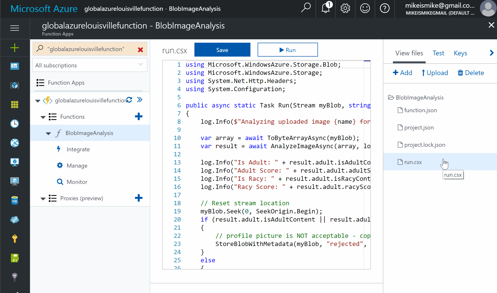

# Booster 2018

## Homework!

We will begin by creating a new Function; Scroll past the Get started quickly... heading and click *Custom* function under the Get started on your own heading. 

### New Function

1. Click **BlobTrigger-CSharp**

   1. Enter **BlobImageAnalysis** for the function name 
   1. For the Path Box `uploaded/{name}.{ext}` to define the blob storage trigger to the **uploaded** container. {name} and {ext} refer to function app parameters that will be passed in by the Azure function app API automatically. For example, when a profile picture is uploaded with the name *mypicture.jpeg*, it will be parsed into two variables: 
       * name : *mypicture*
       * ext : *jpeg*

   1. Click the Create button to create the Azure Function.

1. When the Azure Function is created, a code editor window will appear. Replace the code shown in the code editor with the following statements:

```csharp
using Microsoft.WindowsAzure.Storage.Blob;
using Microsoft.WindowsAzure.Storage;
using System.Net.Http.Headers;
using System.Configuration;

public async static Task Run(Stream myBlob, string name, string ext, TraceWriter log)
{       
    log.Info($"Analyzing uploaded image {name} for appropriate content...");

    var array = await ToByteArrayAsync(myBlob);
    var result = await AnalyzeImageAsync(array, log);

    log.Info("Is Adult: " + result.adult.isAdultContent.ToString());
    log.Info("Adult Score: " + result.adult.adultScore.ToString());
    log.Info("Is Racy: " + result.adult.isRacyContent.ToString());
    log.Info("Racy Score: " + result.adult.racyScore.ToString());

    // Reset stream location
    myBlob.Seek(0, SeekOrigin.Begin);
    if (result.adult.isAdultContent || result.adult.isRacyContent)
    {
        // profile picture is NOT acceptable - copy blob to the "rejected" container
        StoreBlobWithMetadata(myBlob, "rejected", name, ext, result, log);
    }
    else
    {
        // profile picture is acceptable - copy blob to the "profile-pics" container
        StoreBlobWithMetadata(myBlob, "profile-pics", name, ext, result, log);
    }
}

private async static Task<ImageAnalysisInfo> AnalyzeImageAsync(byte[] bytes, TraceWriter log)
{
    HttpClient client = new HttpClient();

    var key = ConfigurationManager.AppSettings["SubscriptionKey"].ToString();
    client.DefaultRequestHeaders.Add("Ocp-Apim-Subscription-Key", key);

    HttpContent payload = new ByteArrayContent(bytes);
    payload.Headers.ContentType = new MediaTypeWithQualityHeaderValue("application/octet-stream");

    var results = await client.PostAsync("https://westus.api.cognitive.microsoft.com/vision/v1.0/analyze?visualFeatures=Adult", payload);
    var result = await results.Content.ReadAsAsync<ImageAnalysisInfo>();
    return result;
}

// Writes a blob to a specified container and stores metadata with it
private static void StoreBlobWithMetadata(Stream image, string containerName, string blobName, string ext, ImageAnalysisInfo info, TraceWriter log)
{
    log.Info($"Writing blob and metadata to {containerName} container...");

    var connection = ConfigurationManager.AppSettings["AzureWebJobsStorage"].ToString();
    var account = CloudStorageAccount.Parse(connection);
    var client = account.CreateCloudBlobClient();
    var container = client.GetContainerReference(containerName);

    try
    {
        var blob = container.GetBlockBlobReference($"{blobName}.{ext}");

        if (blob != null) 
        {
            // Upload the blob
            blob.UploadFromStream(image);

            // Set the content type of the image
            blob.Properties.ContentType = "image/" + ext;
            blob.SetProperties();

            // Get the blob attributes
            blob.FetchAttributes();

            // Write the blob metadata
            blob.Metadata["isAdultContent"] = info.adult.isAdultContent.ToString(); 
            blob.Metadata["adultScore"] = info.adult.adultScore.ToString("P0").Replace(" ",""); 
            blob.Metadata["isRacyContent"] = info.adult.isRacyContent.ToString(); 
            blob.Metadata["racyScore"] = info.adult.racyScore.ToString("P0").Replace(" ",""); 

            // Save the blob metadata
            blob.SetMetadata();
        }
    }
    catch (Exception ex)
    {
        log.Info(ex.Message);
    }
}

// Converts a stream to a byte array 
private async static Task<byte[]> ToByteArrayAsync(Stream stream)
{
    Int32 length = stream.Length > Int32.MaxValue ? Int32.MaxValue : Convert.ToInt32(stream.Length);
    byte[] buffer = new Byte[length];
    await stream.ReadAsync(buffer, 0, length);
    return buffer;
}

public class ImageAnalysisInfo
{
    public Adult adult { get; set; }
    public string requestId { get; set; }
}

public class Adult
{
    public bool isAdultContent { get; set; }
    public bool isRacyContent { get; set; }
    public float adultScore { get; set; }
    public float racyScore { get; set; }
}
```

Run is the method called each time the function is executed. The Run method uses a helper method named AnalyzeImageAsync to pass each blob added to the "uploaded" container to the Computer Vision API for analysis. Then it calls a helper method named StoreBlobWithMetadata to create a copy of the blob in either the "profile-pics" container or the "rejected" container, depending on the scores returned by AnalyzeImageAsync.

1. Click the Save button at the top of the code editor to save your changes. Then click View Files.

   

1. Click + Add to add a new file, and name the file project.json.

   

1. Add the following statements to `project.json`, which wil instruct the function runtime, to grab the NuGet package of the named version, and install in the runtime, as a dependency for our function

   ```json
   {
      "frameworks": {
        "net46": {
            "dependencies": {
               "WindowsAzure.Storage": "8.1.1"
            }
         }
      }
   }
   ```

1. Click the Save button to save your changes. Then click run.csx to go back to that file in the code editor.


An Azure Function written in C# has been created, complete with a JSON project file containing information regarding project dependencies. The next step is to add an application setting that Azure Function relies on.


### Adding a Subscription Key to Application Settings

The Azure Function you created in the previous exercise loads a subscription key for the Microsoft Cognitive Services Computer Vision API from application settings. 

This key is required in order for your code to call the Computer Vision API, and is transmitted in an HTTP header in each call. Now, you will add an application setting containing the subscription key to the Function App.

1. Navigate to your Cognative Services Computer Vision endpoint

1. Uder the *Keys* Blade, click Copy under Key 1 in your Computer Vision subscription to copy the subscription key to the clipboard.

1. Return to your Function App in the Azure Portal and click on the function app name on the left (as shown in the image below).

   

1. On the right, select the **Platform** features tab at top. 

   1. Under *General Settings*, click **Application settings**.

1. Scroll down until you find the App settings section. 

   1. Add a new app setting named **SubscriptionKey**, and paste the *Cognitive Services API subscription key* that is on the clipboard into the **Value** box.
   
   1. Then click Save at the top of the blade.

   

The app settings are now configured for your Azure Function.

### Testing the Azure Function

Your function is configured to listen for changes to the blob container named "uploaded" that you created earlier in this workshop. Each time an image appears in the container, the function executes and passes the image to the Computer Vision API for analysis. To test the function, you simply upload images to the container. In this exercise, you will use the Azure Portal to upload images to the "uploaded" container and verify that copies of the images are placed in the "accepted" and "rejected" containers.

1. In the Azure Portal, go to the resource group created for your Function App.

1. Then click the storage account that you created for your images earlier in the workshop

1. Click Blobs to view the contents of blob storage.

1. Click uploaded to open the "uploaded" container.

1. Click Upload.

   1. Click the button with the folder icon to the right of the Files box. Select one or more image files. Then click the Upload button to upload the files to the "uploaded" container.


1. Uploading images to the "uploaded" container

1. Close the blade for the "uploaded" container and open the "profile-pics" container.

1. Verify that the "profile-pics" container holds the images you uploaded. These are the images that were classified as appropriate images by the Computer Vision API.

1. It may take a minute or more for all of the images to appear in the container. If necessary, click Refresh every few seconds until you see all the images you expect.

1. Close the blade for the "profile-pics" container and open the blade for the "rejected" container.

1. Verify that the rejected container holds the number of images you would expect to be rejected. These images were classified as inappropriate by the Computer Vision API.

1. The presence of all images in the profile-pics and rejected containers is proof that your Azure Function executed each time an image was uploaded to the "uploaded" container. If you would like, return to the BlobImageAnalysis function in the portal and click Monitor. You will see a log detailing each time the function executed.

### Viewing Blob Metadata

What if you would like to view the scores for adult content and raciness returned by the Computer Vision API for each image uploaded to the "uploaded" container? The scores are stored in blob metadata for the images in the "profile-pics" and "rejected" containers, but blob metadata can't be viewed through the Azure Portal.

In this exercise, you will use the cross-platform Microsoft Azure Storage Explorer to view blob metadata and see how the Computer Vision API scored the images you uploaded.

1. Start Storage Explorer. Find your storage account you've been working with and expand the list of blob containers underneath it. Then click the container named profile-pics.

1. Right-click an image in the "profile-pics" container and select Properties from the context menu.

1. Inspect the blob's metadata. IsAdultContent and isRacyContent are Boolean values that indicate whether the Computer Vision API detected adult or racy content in the image. adultScore and racyScore are the computed probabilities.


You can probably imagine how this might be used in the real world. Suppose you were building a photo-sharing site and wanted to prevent adult images from being stored. You could easily write an Azure Function that inspects each image that is uploaded and deletes it from storage if it contains adult content.

## Summary

In this stage you learned how to:

* Create an Azure Function App
* Write an Azure Function that uses a blob trigger
* Add application settings to an Azure Function App
* Use Microsoft Cognitive Services to analyze images and store the results in blob metadata

This is just one example of how you can leverage Azure Functions to automate repetitive tasks. Experiment with other Azure Function templates to learn more about Azure Functions and to identify additional ways in which they can aid your research or business.


Thank you, Hope you enjoyed this workshop.
Damian
